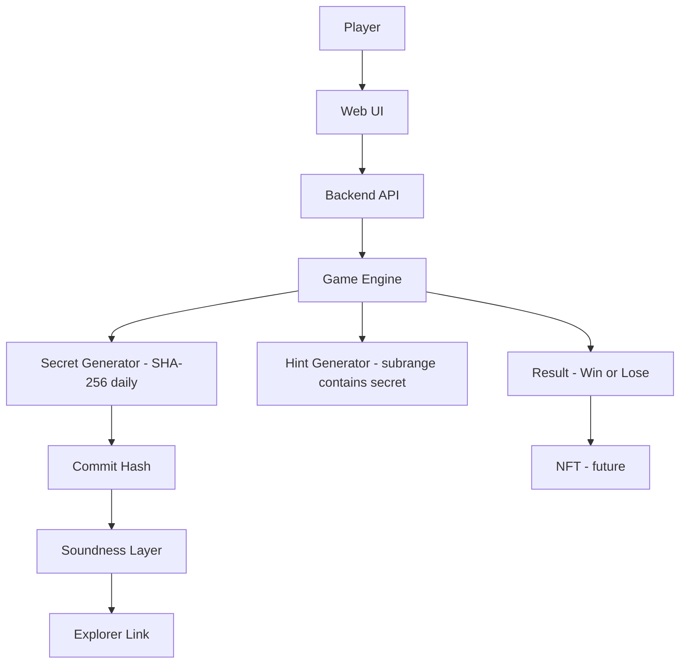

# Soundness Guess Fun 🎮🔐

## 1. Idea Introduction
**Soundness Guess Fun** is an interactive web mini-game that applies a binary search–style mechanic to guess a hidden number.

- Players have **5 lives**, each turn limited to **12 seconds**, to decide whether the secret lies in the left or right half of the current range (0–399).
- Each correct choice keeps the game alive:
  → *“✅ You are on the right path, keep going!”*
- Each wrong or timeout choice reduces the remaining lives.
- The game ends when the number is revealed, or when the player runs out of lives.

The design mirrors **incremental verification** in Soundness Layer (SL):
- Instead of brute-forcing, the player makes **progressive narrowing proofs**.
- Each correct move is like a **valid attestation**.
- Wrong moves behave like **invalid proofs → penalty (life reduction).**

👉 **Future expansion:**  
Winners of the game can be rewarded with a special **“Soundness Guess Testnet NFT.”**
- This NFT can be **staked** on the testnet for additional benefits.
- Over time, NFTs may **evolve/upgrade** (e.g., new artwork, higher rarity) based on play history or performance, creating a verifiable play-to-earn experience.

---

## 2. Why it fits Soundness
- **Deterministic secret + attestability:** the secret number is derived per day from a seed (commit), enabling commit→reveal verification.
- **Sound hint:** each hint strictly contains the secret, so progress is objectively verifiable.
- **Real-time UX:** 12s per turn simulates low-latency verification, aligned with SL goals.
- **Asset link:** NFT reward + staking/evolution turns verifiable play into tangible testnet participation.

---

## 3. Technical Architecture (with SL integration plan)
- **Frontend:** Vanilla JS + HTML/CSS (two-button UI ≤ / >, HUD with lives & timer).
- **Backend:** Node.js/Express server.
- **Deterministic secret:** `secret = f(GAME_SECRET_SEED, dayKey)` using SHA-256; `commitHash = sha256(secret)`.
- **API:**
  - `POST /api/start` — init session (range `[0..399]`, lives=5).
  - `POST /api/choose` — submit `left|right|timeout`; correct narrows range (no life loss); wrong/timeout loses 1 life and returns a **sound hint** that **guarantees** the secret is inside.
  - `GET /api/reveal` (optional) — returns `{dayKey, commitHash, secret}` for validation.

### Integration phases
- **Phase 1:** MVP with deterministic daily secret + public commit hash (off-chain reveal).
- **Phase 2:** **Attest daily commit on Soundness Layer (Walrus/Sui)**; expose `attestationId/txDigest` and an explorer link in the UI.
- **Phase 3 (optional):** Attested game events (start/wrong/timeout/win) and/or a lightweight zk proof that each hint contains the secret.

---

## 4. Roadmap / Next Steps
- [x] Playable web demo with deterministic daily secret + robust hint.
- [x] Timer (12s/turn) + 5 lives.
- [ ] **Attest daily commit on Soundness Layer (Walrus/Sui)** and show link in UI.
- [ ] Persist key game events to SL; add a `/verify` endpoint and public viewer.
- [ ] **Mint “Soundness Guess Testnet NFT” for winners.**
- [ ] Enable NFT **staking** and **evolution mechanics** to drive long-term engagement.

---
## 5. Activity & Integration Diagram

The diagram below shows how the game connects to the Soundness Layer for verifiable gameplay:

## 6. Contacts
- **GitHub:** ntllinh2511
- **Discord:** ntllinh2511
- **X (Twitter):** @ntl_linh2511
